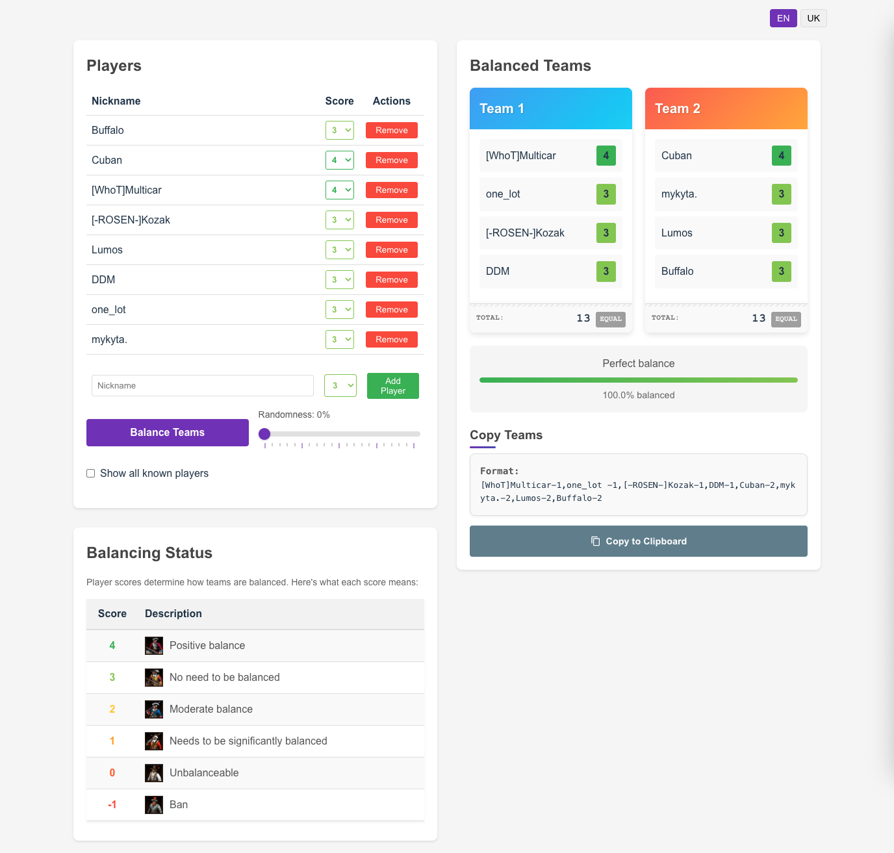

# 😩 Teammates suck!



A web application for balancing teams based on player skill levels.

## Project Structure

- **Backend**: Flask API with Gunicorn for team balancing logic and Google Sheets integration
- **Frontend**: React application with Vite for the user interface

## Key Features

- **Team Balancing Algorithm**: Automatically creates balanced teams based on player skill levels
- **Google Sheets Integration**: Fetches player data from a Google Spreadsheet
- **Randomness Control**: Adjustable randomness factor for team balancing
- **Internationalization**: Supports Ukrainian (default) and English languages
- **Responsive Design**: Works on both desktop and mobile devices

## Docker Setup

This project is containerized using Docker, making it easy to set up and run in any environment.

### Prerequisites

- [Docker](https://docs.docker.com/get-docker/)
- [Docker Compose](https://docs.docker.com/compose/install/)

### Environment Variables

Create .env with the following envs:
```bash
GOOGLE_API_KEY=...
SPREADSHEET_ID=...
```

### Running with Docker Compose

#### Development Environment

For development with hot-reloading:

```bash
# Using the helper script
./dev.sh

# Or manually
docker-compose -f docker-compose.dev.yml up --build
```

#### Production Environment

For production deployment:

```bash
# Using the helper script
./prod.sh

# Or manually
docker-compose -f docker-compose.prod.yml up -d --build
```

This will:
- Build the backend and frontend Docker images
- Start the containers (backend on port 5050, frontend on port 80)
- Make the application available at http://localhost

To stop the application:

```bash
# Development
docker-compose -f docker-compose.dev.yml down

# Production
docker-compose -f docker-compose.prod.yml down
```

### Development Features

When using the development environment:
- The backend runs with Gunicorn's auto-reload enabled (2 workers)
- The frontend runs on port 5173 with Vite's hot module replacement
- Source code changes are detected automatically
- Console output is displayed in real-time

### Rebuilding Images

If you make changes to the Dockerfiles and need to rebuild the images:

```bash
# Development
docker-compose -f docker-compose.dev.yml up --build

# Production
docker-compose -f docker-compose.prod.yml up -d --build
```

The helper scripts (`dev.sh` and `prod.sh`) always rebuild the images automatically.

## Manual Setup (Without Docker)

If you prefer to run the application without Docker, follow these steps:

### Backend Setup

```bash
cd backend
python -m venv .venv
source .venv/bin/activate  # On Windows: .venv\Scripts\activate
pip install -r requirements.txt

# Run with Flask development server (development only)
python app.py

# Or run with Gunicorn (recommended for production)
gunicorn --workers=4 --bind=0.0.0.0:5050 app:app
```

### Frontend Setup

```bash
cd frontend
npm install
npm run dev
```

## Testing

- Backend tests use pytest and can be run with `python -m pytest` in the backend directory
- Frontend tests use Vitest and can be run with `npm test` in the frontend directory

## Documentation

- [Backend Documentation](backend/README.md)
- [Frontend Documentation](frontend/README.md)
