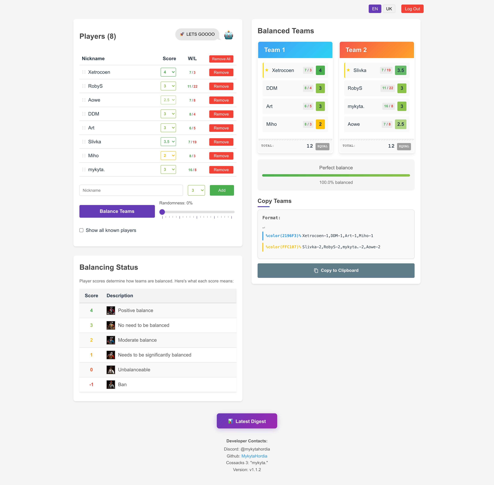

# 😩 Teammates suck!

       



A web application for balancing teams based on player skill levels.

## Project Structure

- **Backend**: Flask API with Gunicorn for team balancing logic and Google Sheets integration
- **Frontend**: React application with Vite for the user interface

## Key Features

- **Team Balancing Algorithm**: Automatically creates balanced teams based on player skill levels
- **Google Sheets Integration**: Fetches player data from a Google Spreadsheet
- **SQLite Database**: Stores player wins and losses for tracking performance
- **Admin Authentication**: Secure admin authentication for submitting game results
- **Flexible Lobby**: Drag-and-drop user table with win/loss statistics
- **Randomness Control**: Adjustable randomness factor for team balancing
- **Internationalization**: Supports Ukrainian (default) and English languages
- **Responsive Design**: Works on both desktop and mobile devices

## Docker Setup

This project is containerized using Docker, making it easy to set up and run in any environment. The project includes separate Docker images for the backend and frontend, united in docker-compose files.

### Prerequisites

- [Docker](https://docs.docker.com/get-docker/)
- [Docker Compose](https://docs.docker.com/compose/install/)

### Environment Variables

Create .env with the following envs:
```bash
# Google Sheets API (optional if using SQLite only)
GOOGLE_API_KEY=...
SPREADSHEET_ID=...

# Docker registry for deployment
REGISTRY_URL=...

# Deployment configuration (optional)
SSH_USER=...
VPS_ADDRESS=...
REMOTE_PATH=...
BUILD_TAG=...
```

### Running with Docker Compose

The project uses two docker-compose files:
- `docker-compose.dev.yml` - For development environment with hot-reloading
- `docker-compose.yml` - For production environment

### Dockerhub images

You can use the pre-built images from Dockerhub where both linux/arm64 and linux/amd64 are available:
- nikitagordia/teammates-suck-frontend
- nikitagordia/teammates-suck-backend


#### Development Environment

For development with hot-reloading:

```bash
# Using the helper script
./dev.sh

# Or manually
docker-compose -f docker-compose.dev.yml up --build
```

#### Production Environment

For production deployment:

```bash
# Using the helper script
./prod.sh

# Or manually
docker-compose up -d --build
```

This will:
- Build the backend and frontend Docker images
- Start the containers (backend on port 5050, frontend on port 80)
- Make the application available at http://localhost

To stop the application:

```bash
# Development
docker-compose -f docker-compose.dev.yml down

# Production
docker-compose down
```

### Development Features

When using the development environment:
- The backend runs with Gunicorn's auto-reload enabled (2 workers)
- The frontend runs on port 5173 with Vite's hot module replacement
- Source code changes are detected automatically
- Console output is displayed in real-time

### Rebuilding Images

If you make changes to the Dockerfiles and need to rebuild the images:

```bash
# Development
docker-compose -f docker-compose.dev.yml up --build

# Production
docker-compose up -d --build
```

The helper scripts (`dev.sh` and `prod.sh`) always rebuild the images automatically.

## Manual Setup (Without Docker)

If you prefer to run the application without Docker, follow these steps:

### Backend Setup

```bash
cd backend
python -m venv .venv
source .venv/bin/activate  # On Windows: .venv\Scripts\activate
pip install -r requirements.txt

# Run with Flask development server (development only)
python app.py

# Or run with Gunicorn (recommended for production)
gunicorn --workers=4 --bind=0.0.0.0:5050 app:app
```

### Frontend Setup

```bash
cd frontend
npm install
npm run dev
```

## Testing

- Backend tests use pytest and can be run with `python -m pytest` in the backend directory
- Frontend tests use Vitest and can be run with `npm test` in the frontend directory

## Utility Scripts

The project includes several utility scripts for managing the database:

### Admin Management

```bash
# Add a new admin (format: admin:password)
docker compose exec backend python -m src.utils.admin add "admin:password"

# Remove an admin
docker compose exec backend python -m src.utils.admin remove "admin"
```

### User Management

```bash
# Clean history (wins and losses) for a specific user
docker compose exec backend python -m src.utils.user clean "nickname"
```

## Release guide

1. Update the `BUILD_TAG` in `.env` to the desired version (e.g., `v1.3.1` -> `v1.3.2`)
2. Run `./tag_release.sh` to create a Git tag based on the `BUILD_TAG`
3. Push the tag to the remote repository (`git push origin main --tags`)
4. Run `./build_and_push.sh` to build and push the Docker images with the new tag
5. Run `./deploy.sh` to build and deploy the Docker images with the new tag

## Digest guide

1. Generate digest for the previous month locally with:
`docker compose exec backend python -m src.utils.digest generate --no-plots`
2. Start applying process:
`docker compose exec backend python -m src.utils.digest apply`
3. Adjust scores for promoted/devoted players according to the calculations
4. `y` for clearing history for selected players

## Documentation

- [Backend Documentation](backend/README.md)
- [Frontend Documentation](frontend/README.md)
